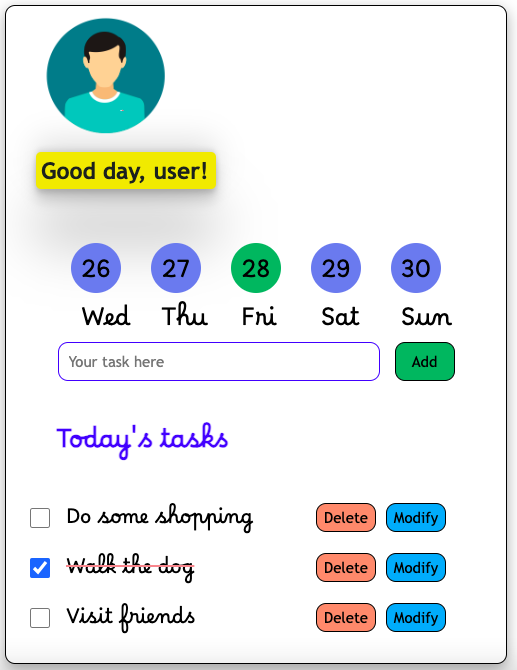

# To do list application

> An application capable of tracking activities, deleting them and modifying them.

## Table of contents

- [To do list application](#to-do-list-application)
  - [Table of contents](#table-of-contents)
  - [General info](#general-info)
  - [Screenshots](#screenshots)
  - [Technologies](#technologies)
  - [Setup](#setup)
  - [Code Examples](#code-examples)
  - [Features](#features)
  - [Status](#status)

## General info

> The objective of the project is to practice separation of concern in
> JavaScript by implementing a To-do list app.

## Screenshots




## Technologies

- JavaScript
- HTML5
- CSS3
- VSC code

## Setup

clone the repo and start using the stop watch.

## Code Examples

```js
import displayDatesHandler from "../handlers/displayDatesHandler.js";

const displayDatesListener = () => {
    window.addEventListener('load', displayDatesHandler);
}

export default displayDatesListener;
```

## Features

List of features ready and Todos for future development

- Organize tasks according to dates

To-do list:

- Add tasks
- Edit tasks
- Delete tasks

## Status

Project is: _Completed_
